# Chime Meeting

A production-oriented Flutter client for secure 1:1 real-time meetings using Amazon Chime. The application separates meeting bootstrap, presentation state, platform media, and backend credential handling so that the UI remains SDK-agnostic and the meeting lifecycle is explicit, observable, and testable.

The target product scope is a Flutter mobile application for **Android and iOS**. The current native Amazon Chime media implementation is complete on Android. The iOS project and privacy configuration are present, while the native iOS Chime adapter remains a documented limitation. Chrome/Web support is additional development and integration tooling and is not part of the primary mobile scope.

## Table of contents

1. [Application walkthrough](#application-walkthrough)
2. [Overview](#overview)
3. [Scope and implementation approach](#scope-and-implementation-approach)
4. [Architecture](#architecture)
   - [System architecture](#system-architecture-at-a-glance)
   - [Flutter architecture](#flutter-architecture-clean-architecture--bloc)
   - [Dependency injection](#dependency-injection)
   - [Repository layout](#repository-layout)
5. [Meeting lifecycle](#meeting-lifecycle)
6. [Control plane: Create and Join](#control-plane-meeting-creation-and-join)
7. [Data flow and trust boundaries](#data-flow-and-trust-boundaries)
8. [Media plane: Amazon Chime](#media-plane-amazon-chime)
9. [Reliability and error handling](#reliability-and-error-handling)
10. [Observability](#observability)
11. [Security model](#security-model)
12. [Backend: Cloudflare Worker and D1](#backend-cloudflare-worker-and-d1)
13. [Setup and run](#setup-and-run)
14. [Validation](#validation)
15. [Failure scenarios](#failure-scenarios-and-expected-behavior)
16. [Engineering decisions and trade-offs](#engineering-decisions-and-trade-offs)
17. [Known limitations](#known-limitations)
18. [Documentation](#documentation)

### Recommended reading path

For a quick technical review, read this README first, then use [`docs/SETUP_AND_RUN.md`](docs/SETUP_AND_RUN.md) to reproduce the environment. For deeper implementation detail, continue with [`docs/ARCHITECTURE.md`](docs/ARCHITECTURE.md), [`docs/GATEWAY_DATA_FLOW.md`](docs/GATEWAY_DATA_FLOW.md), and [`docs/CLOUDFLARE_GATEWAY.md`](docs/CLOUDFLARE_GATEWAY.md). Native Android troubleshooting and release preparation are documented separately.

---

# Application walkthrough

The screenshots below show the Android meeting lifecycle from the idle state through meeting bootstrap, Amazon Chime session startup, the connected call UI, and the SDK-backed event log.

| | | |
| :---: | :---: | :---: |
| 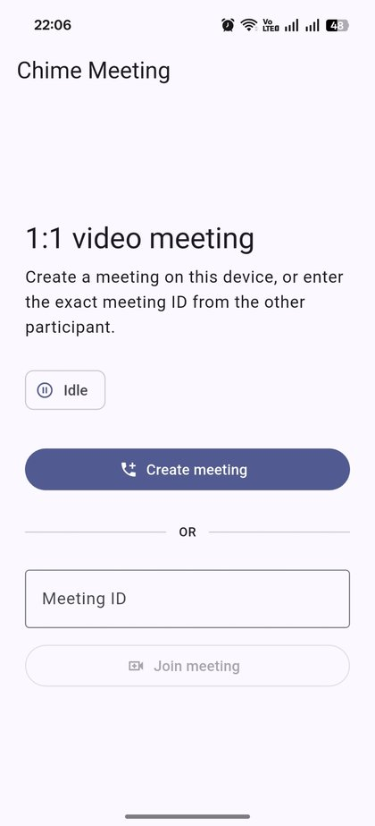<br><sub><b>Idle — Create or Join</b></sub> | 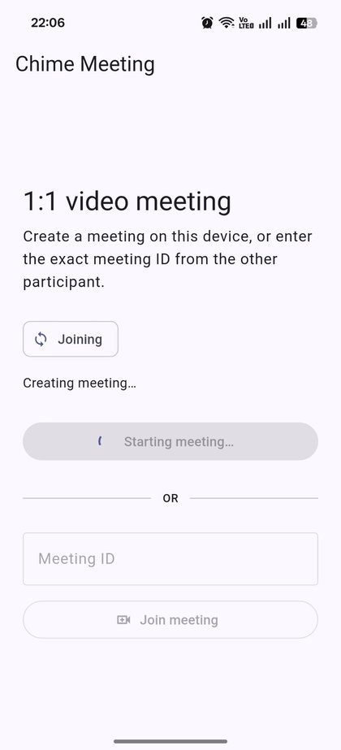<br><sub><b>Creating Meeting</b></sub> | 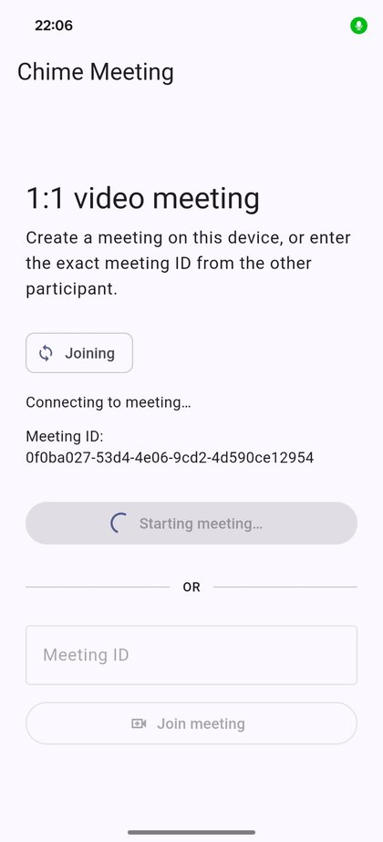<br><sub><b>Starting Chime Session</b></sub> |
| 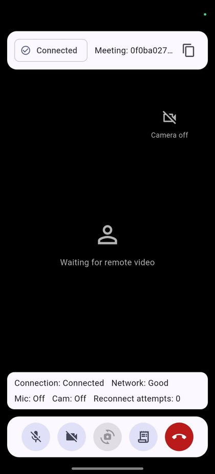<br><sub><b>Connected Call</b></sub> | 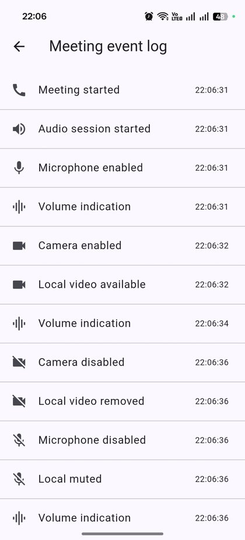<br><sub><b>Meeting Event Log</b></sub> | |

A successful Create/Join API response provides meeting bootstrap data; it does not mark the call connected. The application remains in `joining` until the current Amazon Chime session emits its session-start callback. The event-log screen exposes lifecycle and media callbacks without logging attendee tokens or provider credentials.

---

# Overview

## What the application supports

- Create a new 1:1 meeting and obtain an agent attendee.
- Join an existing meeting with the exact backend-issued `MeetingId` and a fresh client attendee.
- Real-time audio/video through Amazon Chime.
- Microphone mute/unmute, camera on/off, camera switching, leave, and rejoin.
- Local video thumbnail and remote video rendering.
- Explicit call states: `idle`, `joining`, `connected`, `reconnecting`, `disconnected`, and `failed`.
- Chime callback handling for session/audio lifecycle, participants, mute state, video tiles, active speaker, volume, device changes, network degradation, reconnect, recovery, and fatal failures.
- A bounded event log containing the latest 50 meeting events.
- Diagnostics for connection state, coarse network quality, reconnect count, microphone state, and camera state.
- Connectivity and permission preflight before meeting bootstrap.
- Session-start and reconnect watchdogs with stale-session protection.
- Server-side API credential handling through Cloudflare Worker secrets.
- D1-based `MediaPlacement` recovery without persisting attendee credentials.

## Deployed environment

The Flutter client uses one public control-plane endpoint:

```text
MEETING_API_BASE_URL=https://hipster-meeting-gateway.abhishek-kumar-developer09.workers.dev/
```

Public routes:

```text
GET  https://hipster-meeting-gateway.abhishek-kumar-developer09.workers.dev/health
POST https://hipster-meeting-gateway.abhishek-kumar-developer09.workers.dev/meetings
```

The Worker URL is public configuration, not a credential. Flutter never receives the upstream API key, the relay shared secret, or the Render relay URL. Those values remain on server-side infrastructure.

The compatibility relay is deployed from the repository's `render.yaml` as the Render service `hipster-meeting-relay`. Render starts `node local-relay/server.mjs`. Its generated HTTPS URL is stored only in the Worker as `HIPSTER_RELAY_URL`; the Flutter application never calls Render directly. If the upstream accepts Cloudflare egress, the relay is not part of the request path at all.

## Platform status

| Platform | Status | Media integration |
| --- | --- | --- |
| Android | Primary implemented platform | Native Amazon Chime Android SDK `0.25.4` through Kotlin `MethodChannel`/`EventChannel` integration and native `PlatformView` video rendering |
| iOS | Flutter project and privacy configuration present | Native Amazon Chime media adapter is not implemented yet |
| Chrome/Web | Optional development and integration path | Locally bundled Amazon Chime SDK for JavaScript `3.32.0`, typed Dart JS interop, WebRTC, and HTML video surfaces |

The browser implementation is an additional engineering/debugging path. It is not required for the mobile application architecture and can be excluded from a mobile-only deployment.

---

# Scope and implementation approach

## In scope

- secure 1:1 real-time meetings;
- Flutter mobile architecture targeting Android and iOS;
- Amazon Chime media integration behind a platform-neutral domain gateway;
- meeting creation and exact-ID join through the supplied meeting API;
- six explicit lifecycle states: `idle`, `joining`, `connected`, `reconnecting`, `disconnected`, and `failed`;
- Chime callback/event mapping, lifecycle resilience, reconnect handling, diagnostics, and bounded observability;
- production-oriented credential custody and backend request validation.

## Out of scope

- group calling;
- screen sharing;
- persistent meeting history;
- custom signaling or media servers;
- replacing Chime's transport-level retry logic with application-owned reconnect loops.

## Implementation strategy

1. Keep meeting bootstrap and media-session ownership separate.
2. Keep Chime SDK types outside Flutter presentation and domain layers.
3. Make `MeetingBloc` the single application-level lifecycle authority.
4. Treat SDK callbacks, not REST success, as the source of truth for media connectivity.
5. Keep provider credentials server-side behind the Cloudflare Worker.
6. Persist only reusable meeting context; never persist attendee credentials or JoinTokens.
7. Add bounded watchdogs around SDK-controlled startup/recovery rather than competing with Chime's transport behavior.
8. Keep optional compatibility infrastructure behind the same public Worker contract so Flutter does not change when egress routing changes.

---

# Architecture

## System architecture at a glance

The application has two independent paths after a meeting action:

- the **control plane** obtains meeting and attendee configuration;
- the **media plane** owns the active Amazon Chime session.

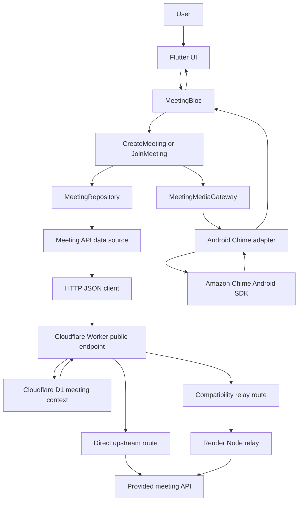

The two Worker-to-upstream paths are deployment alternatives, not parallel requests. Under normal conditions the Worker calls the provided meeting API directly. The relay path is used only when the upstream hosting layer rejects Cloudflare server egress; that case is described later in [Why the optional relay exists](#why-the-optional-relay-exists).

## Flutter architecture: Clean Architecture + BLoC

The project uses **feature-first Clean Architecture with BLoC state management**. It is not a classical MVVM implementation and does not introduce a separate `ViewModel` layer.

`MeetingBloc` owns presentation orchestration and publishes immutable `MeetingState`; widgets render that state and dispatch user intent. Domain use cases and contracts remain independent of Flutter UI concerns, while data and infrastructure layers isolate REST, connectivity, permissions, and platform-specific Chime integration.

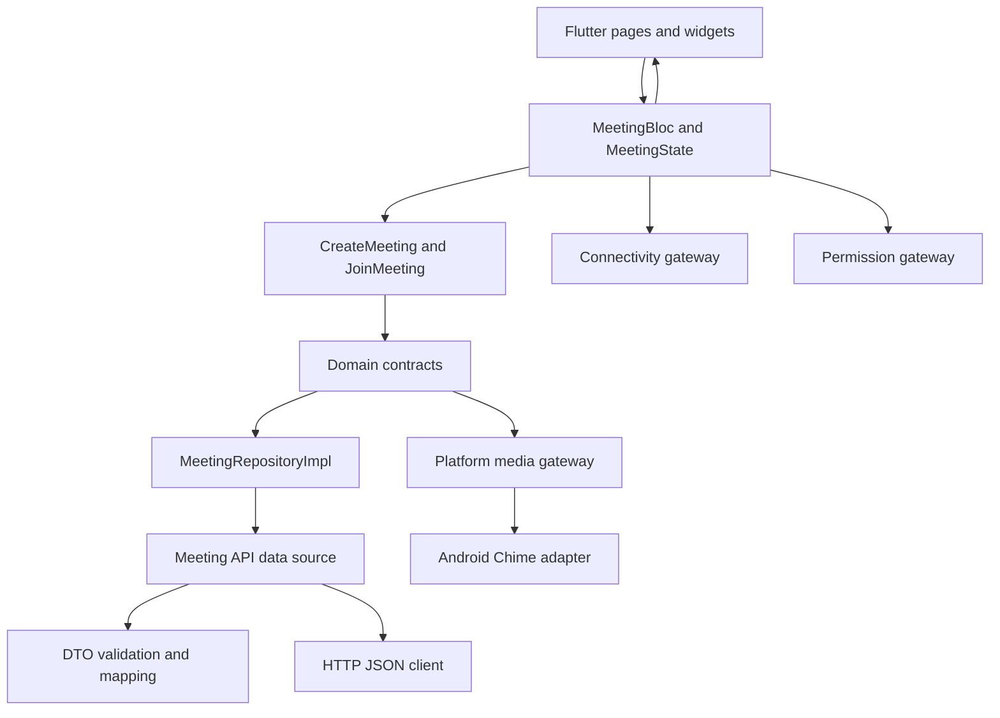

### Dependency injection

`GetIt` is confined to `lib/app/di/dependency_container.dart`, where the object graph is assembled at startup. Repositories, data sources, use cases, gateways, and `MeetingBloc` declare dependencies through constructors and never access the service locator directly.

This keeps dependencies explicit and lets tests replace infrastructure with fakes without changing production code.

### Layer ownership

| Layer | Responsibility |
| --- | --- |
| Flutter widgets | Render `MeetingState`; translate taps and lifecycle changes into BLoC events |
| `MeetingBloc` | Meeting orchestration, state transitions, lifecycle ownership, watchdogs, diagnostics, event log |
| Domain | Entities, typed failures, use cases, repository/gateway contracts; no SDK-specific types |
| Data | REST request construction, DTO validation, mapping, infrastructure-to-domain error classification |
| Infrastructure | HTTP transport, connectivity, permissions, Android platform bridge, optional browser bridge |
| Cloudflare Worker | Request validation, server-side credential injection, upstream validation, safe errors, D1 placement recovery |
| D1 | Short-lived non-attendee meeting context required to recover `MediaPlacement` for Join |
| Amazon Chime SDK | Transport, signaling, real-time media, reconnect behavior, media callbacks |

## Repository layout

```text
lib/
  app/
    di/                         # Composition root only
  core/
    config/                     # Public runtime/build configuration
    error/                      # Typed infrastructure exceptions
    network/                    # Central JSON transport
  features/meeting/
    presentation/               # BLoC, state, pages, controls, diagnostics
    domain/                     # Entities, failures, use cases, gateway contracts
    data/                       # REST data source, DTOs, repository, mapping
    infrastructure/
      chime/                    # Dart side of Android Chime bridge
      connectivity/             # Connectivity adapter
      permissions/              # Native/Web permission adapters
      lifecycle/                # Platform lifecycle policy
      platform/                 # Conditional media adapter selection
      web/                      # Optional Dart-to-JS Chime adapter

android/app/src/main/kotlin/.../chime/
                                 # Native Chime controller, observers, views,
                                 # permissions and safe logger

cloudflare/hipster-meeting-gateway/
  src/                           # Worker, upstream client, D1 store
  migrations/                    # D1 schema
  local-relay/                   # Optional authenticated compatibility relay
  apps-script/                   # Experimental relay fallback

web/chime_bridge/                # Optional TypeScript Chime JS bridge
scripts/                         # Repository validation helper
docs/                            # Detailed architecture/operations notes
```

---

# Meeting lifecycle

`MeetingBloc` is the only application-level authority for the active meeting lifecycle. A REST response or a successful call to `MeetingMediaGateway.start()` does **not** mark the call connected. The application remains in `joining` until Amazon Chime emits the session-start callback.

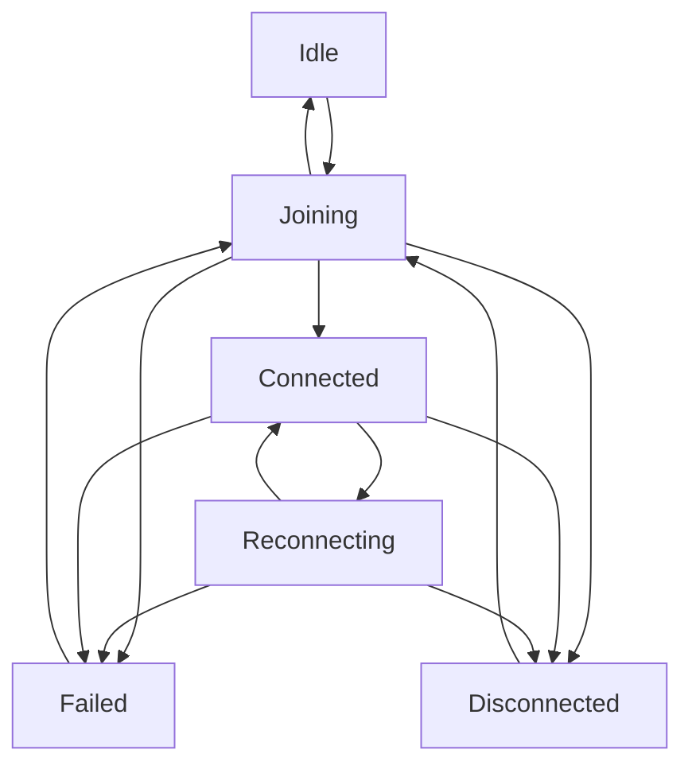

### Session ownership and stale-callback protection

There are two identity layers:

1. a Dart-owned session identity is created before asynchronous bootstrap begins;
2. the first valid Chime `sessionStarted` callback establishes the native/browser generation for that session.

Every session-owned callback is checked against current ownership. A late callback, timeout, lifecycle completion, or reconnect event from a session that has already been left or replaced is ignored instead of mutating the new call.

### Time budgets

| Boundary | Budget | Owner |
| --- | ---: | --- |
| Flutter meeting HTTP request | 15 seconds | `HttpJsonApiClient` |
| Worker/relay upstream call | 12 seconds | Worker upstream client / relay |
| Chime initial media start | 20 seconds | `MeetingBloc` |
| One Chime reconnect episode | 25 seconds | `MeetingBloc` |
| D1 context retention | 24 hours | Cloudflare Worker |

The shorter backend timeout leaves time for the Worker to classify and return a typed upstream failure before Flutter's outer deadline expires.

---

# Control plane: meeting creation and join

Flutter communicates with one public backend base URL supplied through `MEETING_API_BASE_URL`. The app never requires the upstream API key.

## Network calls

| Source | Destination | Call | Authentication/data policy |
| --- | --- | --- | --- |
| Flutter | Cloudflare Worker | `GET /health` when manually checked | Public health endpoint |
| Flutter | Cloudflare Worker `https://hipster-meeting-gateway.abhishek-kumar-developer09.workers.dev` | `POST /meetings` | JSON only; no upstream API credential |
| Worker | D1 | Read/write meeting context | Meeting ID + placement + optional region + timestamps only |
| Worker | Provided meeting API | `POST /api/meetings` | Server-side `x-api-key`; direct mode |
| Worker | Render/local compatibility relay | `POST /meetings` | Server-to-server bearer authentication; provider key forwarded transiently only in compatibility mode |
| Render/local relay | Provided meeting API | `POST /api/meetings` | Provider key applied as upstream `x-api-key`; never returned to Flutter or persisted by the relay |
| Active client | Amazon Chime endpoints | Signaling/media traffic | Chime-issued meeting/attendee configuration held in memory |

## Create request

Flutter sends:

```json
{
  "type": "agent"
}
```

The Worker validates the response before it is returned to the app. Create requires a meeting identifier, attendee credentials, and valid Chime `MediaPlacement`.

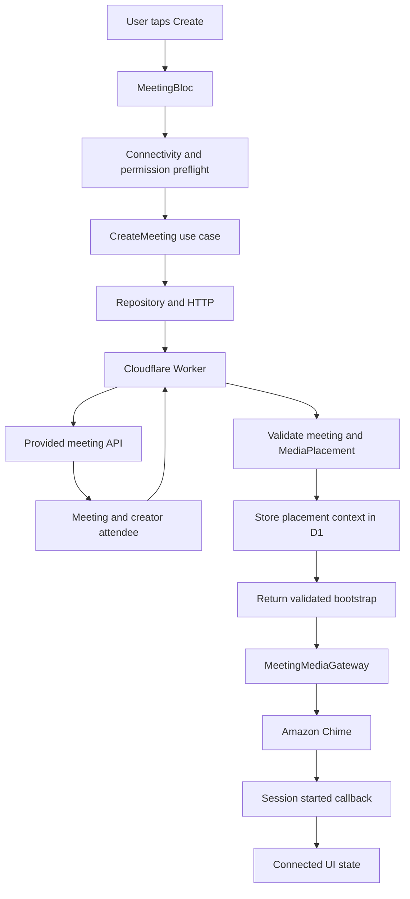

The Worker waits for the D1 context write before returning Create success. This makes the same meeting immediately joinable even when the upstream Join response does not repeat `MediaPlacement`.

## Join request

Flutter validates and trims the user-supplied meeting ID, then sends the exact backend-issued value:

```json
{
  "type": "client",
  "meeting_id": "<exact MeetingId>"
}
```

A Join request always obtains a **fresh attendee** from the current upstream response. Cached creator credentials are never reused.

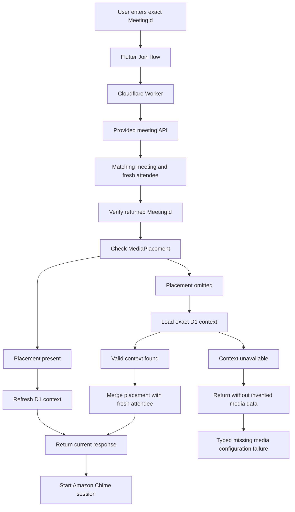

### Why D1 exists

The documented Join response can contain the meeting ID and fresh attendee credentials without the full media placement required to construct an Amazon Chime session. The Worker therefore keeps only the reusable meeting context:

```text
meeting_id
media_placement_json
media_region (optional)
created_at
expires_at
```

It does **not** store:

```text
JoinToken
AttendeeId
ExternalUserId
API key
complete attendee objects
```

If a valid exact-match placement cannot be recovered, the system fails safely. It never fabricates Chime endpoints and never takes placement from another meeting.

---

# Data flow and trust boundaries

This is the end-to-end data flow independently of the UI architecture.

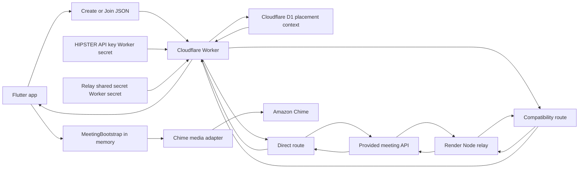
### Control-plane routing

The client always sends Create/Join JSON to the Cloudflare Worker. In **direct mode**, the Worker injects the upstream credential and calls the provided meeting API itself. In **compatibility mode**, the Worker authenticates to the Render/local relay using the server-only relay secret and forwards the provider credential transiently; the relay validates the fixed `/meetings` route and then calls the same upstream meeting API.

`render.yaml` deploys the relay as a Node service using `node local-relay/server.mjs`. The relay is deliberately stateless for meeting identity: D1 remains owned by the Worker, and attendee credentials are never stored in D1 or by the relay. The egress hop can therefore change without changing Flutter, BLoC, domain contracts, or the Chime media path.


### Data classification

| Data | Client | Worker | D1 | Relay | Logging |
| --- | --- | --- | --- | --- | --- |
| Worker base URL | Public configuration | N/A | No | No | Safe |
| Meeting ID | UI/domain state | Request validation | Stored for context key | Transient | Not logged by gateway |
| `MediaPlacement` | Active bootstrap | Validated/merged | Stored with expiry | Transient | URLs not logged |
| `AttendeeId` | Active session memory | Validated/transient | **Never** | Transient | Redacted/not logged |
| `ExternalUserId` | Active session memory | Validated/transient | **Never** | Transient | Redacted/not logged |
| `JoinToken` | Active session memory | Validated/transient | **Never** | Transient | Redacted/not logged |
| Hipster API key | **Never** | Worker secret | **Never** | Transient only in compatibility mode | **Never** |
| Relay shared secret | **Never** | Worker secret | **Never** | Server environment | **Never** |

Meeting bootstrap credentials are retained only as long as required to construct and operate the active media session. They are not placed in presentation state, local storage, or the event log.

---

# Media plane: Amazon Chime

## Android integration

Android keeps the Chime SDK behind a native adapter rather than exposing SDK objects to Dart.

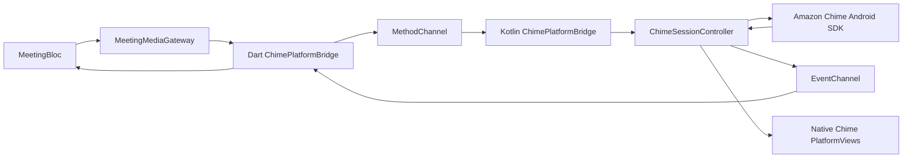

### Session startup

The native controller:

1. validates runtime support and required permission state;
2. converts the backend meeting and attendee configuration into Chime credentials/URLs;
3. constructs one `DefaultMeetingSession`;
4. registers audio/video, realtime, video-tile, active-speaker, and device-change observers;
5. starts `audioVideo`;
6. emits the session-start event only from the Chime callback;
7. starts/binds local and remote video as Chime tiles become available.

Video frames stay in the native Chime renderer. They are not copied through Dart, which avoids unnecessary serialization and frame-transfer overhead.

### Callback model

The native SDK is mapped into SDK-independent domain events, including:

- session started/stopped;
- audio session started/stopped;
- reconnecting, connection poor, and connection recovered;
- participant joined/left;
- local/remote mute and unmute;
- microphone/camera state;
- local/remote video added, removed, paused, and resumed;
- active speaker;
- bounded volume indication;
- audio-device changes;
- fatal session failures.

The UI consumes only domain state/events. No Chime SDK type crosses into presentation.

### Runtime support

The pinned Android Chime media libraries provide ARMv7 and ARM64 native media support. x86/x86_64 media startup is rejected before Chime construction with a typed `unsupportedRuntime` failure instead of allowing a native-link/JNI crash.

## Permissions

Android requests camera and microphone permission through a dedicated platform gateway. The meeting flow performs an initial permission preflight and Create/Join re-check permissions before backend/media startup.

- Normal denial remains retryable.
- Permanent denial exposes an Open Settings path.
- Granting permission later does not silently create another meeting; the user explicitly retries.

The optional browser adapter handles microphone and camera independently so camera denial can remain audio-only and microphone denial can remain listen-only when the SDK/browser permits it.

## Reconnect and network handling

Amazon Chime owns transport reconnection. The application deliberately does not build a second competing retry loop.

When Chime reports a genuine reconnect:

1. BLoC enters `reconnecting` once for the episode;
2. reconnect count increments once;
3. one 25-second watchdog starts;
4. duplicate reconnect callbacks are ignored for counting/timer creation;
5. recovery cancels the watchdog and returns to `connected`;
6. a stale watchdog cannot terminate a newer session;
7. timeout becomes a typed `reconnectTimeout` failure and performs best-effort cleanup.

A `connectionPoor` callback updates coarse network quality but does not by itself create a reconnect episode.

## Application lifecycle

Backgrounding does not automatically leave or recreate a meeting. On native mobile, if the local camera was active, the app asks Chime to stop it and restores it after resume only when the same session still owns the lifecycle operation. A camera explicitly disabled by the user is not restarted.

A remote participant leaving also does not terminate the local session. If the participant rejoins, a new remote video tile can replace the old tile.

---

# Reliability and error handling

The project uses typed failures instead of propagating raw transport, browser, Kotlin, or Chime exceptions into the UI.

Representative failure categories include:

- network unavailable;
- HTTP/upstream timeout;
- unauthorized/rate-limited/server response;
- malformed meeting response;
- invalid meeting ID;
- missing media placement;
- invalid attendee credentials;
- permission denied/permanently denied;
- unsupported runtime;
- media device unavailable/busy/unsupported constraints;
- Chime initialization/start failure;
- reconnect timeout;
- bridge unavailable;
- microphone/camera operation failure;
- terminal session failure.

The repository converts infrastructure exceptions to domain failures. `MeetingBloc` then determines the lifecycle state and user-safe message.

### Duplicate and concurrent action protection

Create/Join bootstrap ownership is claimed before the first asynchronous boundary. While a bootstrap or active/reconnecting session is owned, duplicate requests are ignored. This prevents double meeting creation and competing Chime sessions from rapid taps.

### Cleanup

Leave, session replacement, fatal failure, and disposal use idempotent cleanup. Native/Web adapters remove observers, stop media, detach video surfaces, release active session references, and ignore late callbacks from replaced generations.

---

# Observability

The application exposes diagnostics without exposing credentials.

## In-app event log

The latest 50 Chime-related semantic events are retained in memory and displayed in the event-log screen. High-frequency signals such as volume are bounded/coalesced to avoid turning observability into UI/event-stream pressure.

## Worker diagnostics

The Worker produces structured, allow-listed metadata such as:

- request ID;
- route and method;
- result category;
- upstream HTTP status when one exists;
- coarse upstream content-type category;
- whether anti-bot/location headers were present;
- duration;
- D1 context-cache hit/miss state.

The Worker never logs raw request/response bodies, API credentials, meeting IDs, attendee credentials, JoinTokens, or placement URLs.

Sanitized response headers such as `X-Request-Id` and `X-Gateway-Result-Category` let Flutter/debug tooling identify the failing backend boundary without leaking response contents.

---

# Security model

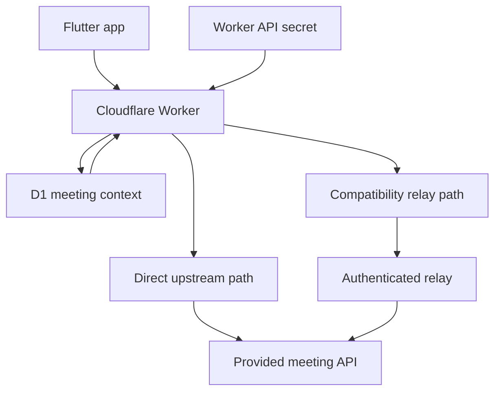

Security decisions implemented in the repository:

- The upstream credential is never compiled into Flutter/Android production code.
- Flutter sends no `x-api-key` header.
- `MEETING_API_BASE_URL` is treated as public configuration, not authentication.
- Worker secrets are configured interactively through Wrangler and are not committed.
- Only HTTPS meeting-gateway URLs are accepted by `AppConfig`.
- Android cleartext traffic is disabled.
- Android backup is disabled to reduce accidental application-data extraction.
- Keystores, `key.properties`, environment files, local relay state, D1 local state, logs, build output, and employer/reference material are excluded from source control.
- Worker request bodies are capped at 8 KiB and meeting IDs are bounded/validated.
- Backend and relay requests use bounded timeouts.
- D1 persists no attendee credentials.
- Native Chime logging redacts the JoinToken, AttendeeId, and ExternalUserId.
- Flutter error handling does not preserve raw meeting response bodies in exceptions.
- Release UI/logging exposes safe failure categories rather than credentials or backend payloads.
- The optional relay is a fixed-purpose `/meetings` proxy with server-to-server authentication, not an open proxy.

### Web-only diagnostic route

The repository contains a Chrome-only direct-fetch diagnostic shim. Its local key file is gitignored and empty by default. It is not part of the mobile architecture and must remain disabled in a shared/release build. A browser-bundled API key is observable through DevTools and is not an acceptable production secret boundary.

---

# Backend: Cloudflare Worker and D1

The deployed public Worker for this repository is `https://hipster-meeting-gateway.abhishek-kumar-developer09.workers.dev/`. Flutter treats that URL as `MEETING_API_BASE_URL`. The Worker is the only backend address the client needs to know.

The optional Render relay is provisioned by `render.yaml` as service `hipster-meeting-relay` and starts `node local-relay/server.mjs`. Its generated HTTPS URL is configured in the Worker through `HIPSTER_RELAY_URL`, so changing relay egress does not require a Flutter rebuild.

The backend adapter is intentionally small. Flutter still owns the product flow; the Worker owns only concerns that should not live in a client binary:

- secret custody;
- strict request validation;
- calling the fixed upstream meeting endpoint;
- safe status/error mapping;
- validating the success envelope;
- recovering `MediaPlacement` for exact-ID joins;
- minimal structured observability.

## Direct mode: normal architecture

When the upstream accepts Cloudflare server egress, no relay host is needed:

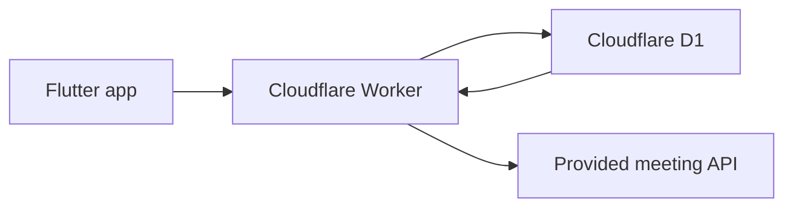

This is the preferred deployment: **Cloudflare Worker + D1 are the only project backend components required.**

## Why the optional relay exists

During integration, the direct Worker path was verified at the application-contract level. A separate upstream-hosting issue was then observed: a valid Cloudflare server request could receive HTTP `202` with HTML and an `sg-captcha` header instead of the documented meeting JSON.

That response cannot be treated as meeting success because it contains no usable `MeetingId`, `MediaPlacement`, `AttendeeId`, or `JoinToken`. The Worker therefore classifies it as an upstream anti-bot challenge and fails safely.

Because the upstream hosting configuration is outside this repository's control, an authenticated relay was added as an **egress compatibility option**. It preserves the same Flutter request, Worker validation, D1 behavior, upstream JSON contract, and server-side credential ownership; only the network egress seen by the upstream changes.

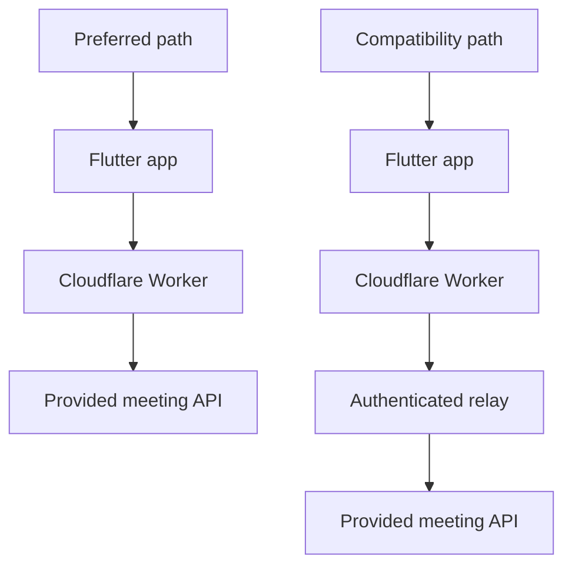

The relay is not a workaround for invalid JSON, D1, or Flutter behavior. It exists only for the observed upstream anti-bot/network-identity boundary.

---

# Setup and run

The full environment, deployment, local-run, relay, Render, optional browser, and validation instructions are maintained separately to keep this README focused on architecture and runtime behavior:

**[docs/SETUP_AND_RUN.md](docs/SETUP_AND_RUN.md)**

For the normal deployment path, only the **Cloudflare Worker + D1** backend is required. The relay options documented there are compatibility paths for environments where the upstream hosting layer challenges Cloudflare server egress instead of returning the expected meeting JSON.

---

# Validation

The current Android implementation has been exercised through the main 1:1 meeting path, including:

- dependency resolution, static analysis, tests, and Android build validation;
- meeting creation through the public Worker;
- joining an existing `MeetingId` with fresh attendee credentials;
- Amazon Chime session startup;
- local and remote media;
- microphone mute/unmute and camera controls;
- leave and rejoin;
- lifecycle state transitions and callback/event logging;
- reconnect and failure-handling paths;
- diagnostics and the bounded last-50 event log.

API success is treated only as bootstrap success. Runtime validation considers the call connected only when the Chime session-start callback reaches the current owned session.

The native iOS Chime adapter is not implemented and is therefore not represented as runtime-validated. Reproduction commands and deployment steps are in [Setup and Run](docs/SETUP_AND_RUN.md).

---

# Failure scenarios and expected behavior

| Scenario | Expected behavior |
| --- | --- |
| Participant B joins late | User A remains connected; remote tile appears when B joins |
| Camera off then on | Same session remains active; local video stops/restarts without new REST bootstrap |
| Temporary network loss | Chime reconnects; BLoC shows `reconnecting`, counts one episode, and enforces the bounded watchdog |
| App backgrounds and returns | Meeting stays owned; previously active native camera is restored only for the same session |
| Remote participant leaves/rejoins | Local session stays active; stale tile is removed and replacement tile can bind |
| Permission denied then granted | Typed denial is shown; retry/settings path rechecks permission without reusing a failed bootstrap |
| Initial Chime startup stalls | 20-second watchdog moves session to `failed` and performs cleanup |
| Reconnect never recovers | 25-second watchdog emits `reconnectTimeout` and terminates only the owned session |
| Join response lacks placement | Worker resolves only exact non-expired D1 context; otherwise Flutter fails safely |
| Upstream returns HTML challenge | Worker rejects it as invalid/anti-bot response; no fake meeting data is created |

---

# Engineering decisions and trade-offs

### BLoC instead of BLoC + separate ViewModel

BLoC already provides intent processing, immutable presentation state, side-effect orchestration, and a test boundary. Adding a second ViewModel layer would duplicate responsibility without improving separation.

### `connected` comes from the SDK, not REST

Meeting creation and media connectivity are different facts. The backend can successfully issue credentials while Chime signaling or media startup still fails. Treating only the Chime callback as connected keeps UI state aligned with the real session.

### Chime owns transport retry

The SDK already knows its signaling/media transport semantics. The application observes reconnect/recovery and adds only a bounded business-level watchdog; it does not compete with Chime using repeated `start()` or repeated REST meeting creation.

### D1 stores placement, never attendee credentials

`MediaPlacement` belongs to the meeting and may be reused for the exact meeting when the Join response omits it. Attendee credentials belong to one participant request and must always remain fresh. Persisting the former but not the latter preserves both correctness and least privilege.

### Backend secret rather than client obfuscation

A mobile or browser binary cannot safely hide a static API key. The key is therefore held by the Worker and applied server-side. This is a security boundary, not an obfuscation technique.

### Relay changes egress only

The compatibility relay was introduced only because an external anti-bot layer challenged the direct Cloudflare network path. It does not change the client contract, business model, D1 schema, or Chime media path. If the upstream accepts Cloudflare egress, the relay should be removed from the runtime path.

---

# Known limitations

- The product is intentionally limited to **1:1 meetings**; group calls are outside scope.
- Native Amazon Chime iOS media integration remains to be implemented; the iOS Flutter project and camera/microphone privacy strings are present.
- Android real media requires an ARMv7/ARM64 runtime for the pinned Chime native libraries.
- The local Quick Tunnel relay is not production uptime infrastructure.
- Render Free cold starts can exceed the current request deadline.
- Hosted relay egress must be compatibility-tested because the upstream anti-bot policy is external to this repository.
- The optional Chrome direct-fetch shim is development-only and must not carry a key in shared builds.
- Browser camera switching depends on Chrome exposing more than one usable video input.
- Screen sharing is not implemented.

---

# Documentation

The repository keeps implementation detail outside the root README where it is operationally useful. The root README is the system overview; the linked documents are intended to be read by responsibility rather than as one monolithic specification.

### How to use the docs

- Start with **this README** for architecture, lifecycle, security boundaries, and major engineering decisions.
- Use **Setup and Run** when reproducing the application or deploying Cloudflare/Render infrastructure.
- Use **Architecture** when reviewing BLoC ownership, platform boundaries, reconnect behavior, and cleanup.
- Use **Gateway Data Flow** when tracing Create/Join, D1 recovery, credentials, and server-to-server routing.
- Use **Cloudflare Gateway** for Worker/D1 operations, secret management, relay configuration, and safe diagnostics.
- Use **Android Troubleshooting** and **Android Release** for native integration and packaging work.

| Document | Purpose |
| --- | --- |
| [`docs/SETUP_AND_RUN.md`](docs/SETUP_AND_RUN.md) | Complete local setup, Cloudflare/D1 deployment, Create/Join usage, optional relay/Render setup, and validation commands |
| [`docs/ARCHITECTURE.md`](docs/ARCHITECTURE.md) | Lifecycle ownership, control/media plane boundaries, reconnect handling, and resource ownership |
| [`docs/GATEWAY_DATA_FLOW.md`](docs/GATEWAY_DATA_FLOW.md) | Create/Join control-plane flow, D1 `MediaPlacement` recovery, and upstream compatibility behavior |
| [`docs/CLOUDFLARE_GATEWAY.md`](docs/CLOUDFLARE_GATEWAY.md) | Worker/D1 configuration, operations, safe diagnostics, and relay configuration |
| [`docs/ANDROID_TROUBLESHOOTING.md`](docs/ANDROID_TROUBLESHOOTING.md) | Native Chime runtime troubleshooting and platform-specific failure analysis |
| [`docs/ANDROID_RELEASE.md`](docs/ANDROID_RELEASE.md) | Android signing, release build preparation, and repository readiness |

The optional browser adapter is documented separately in `docs/WEB_CHIME_INTEGRATION.md`. It is development/integration tooling and is not part of the primary mobile platform scope.

## Summary

The core design keeps responsibilities narrow:

```text
Flutter renders and orchestrates.
The domain owns meeting rules and typed outcomes.
The data layer owns REST contracts.
Platform adapters own Chime SDK details.
Cloudflare owns the upstream secret and meeting-context recovery.
Amazon Chime owns real-time media transport and reconnect mechanics.
```

That separation keeps meeting behavior testable without native SDKs, prevents backend credentials from leaking into client builds, and allows platform-specific media implementations to evolve without rewriting the Flutter application flow.
