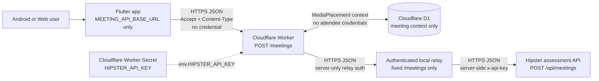
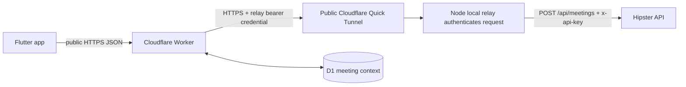
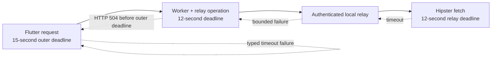

# Cloudflare Hipster Meeting Gateway

## Purpose

The gateway keeps the Hipster credential outside Flutter builds while preserving the app's existing meeting contract:

```text
Flutter -> HTTPS Cloudflare Worker -> authenticated local relay -> Hipster API
                              |
                              +-> D1 meeting context
```

Flutter calls the public Worker URL with `POST /meetings`. The Worker validates the small JSON request, injects the server-side credential, forwards the documented JSON body, and returns the compatible Hipster envelope. The Worker URL is public configuration and must not be treated as an authentication secret.

The project lives at `cloudflare/hipster-meeting-gateway/` and uses native Cloudflare Workers APIs, TypeScript, Wrangler, D1, and pnpm only.

For a shorter visual explanation, see
[GATEWAY_DATA_FLOW.md](GATEWAY_DATA_FLOW.md). It contains box diagrams for the
security boundary, Create, Join recovery, the failed Worker-only route, and the
sanitized live smoke test.

## Current application endpoint

The deployed assessment Worker base URL is public configuration:

```text
https://hipster-meeting-gateway.abhishek-kumar-developer09.workers.dev/
```

It is the only meeting-service value supplied to Flutter:

```powershell
flutter run `
  --dart-define=MEETING_API_BASE_URL=https://hipster-meeting-gateway.abhishek-kumar-developer09.workers.dev/
```

Flutter normalizes the trailing slash and resolves `meetings` to:

```text
https://hipster-meeting-gateway.abhishek-kumar-developer09.workers.dev/meetings
```

Do not supply `HIPSTER_API_KEY`, `x-api-key`, a bearer token, or another static app secret to Flutter.

## Architecture diagram



Security boundary: only the public Worker URL crosses into the APK. The Hipster
credential is stored only as an encrypted Cloudflare binding. Worker code reads
it and transmits it transiently over the authenticated HTTPS relay hop; the
relay does not persist it.

## Why the original Worker-only route failed

The Flutter request and Hipster contract were correct. The failing boundary was
the network identity of the caller:

```text
Direct Flutter/curl -> Hipster
  residential/mobile egress -> HTTP 200 JSON

Cloudflare Worker -> Hipster
  shared cloud egress -> HTTP 202 HTML + sg-captcha
```

SiteGround returned a browser-oriented anti-bot challenge before the Hipster API
could return its meeting envelope. Changing the key, JSON body, HTTPS URL,
timeout, D1, Flutter error handling, or Worker deployment could not turn that
HTML challenge into `MeetingId`, `MediaPlacement`, and attendee credentials.
Accepting HTTP 202 as success would therefore be incorrect.

The local relay changes only the upstream network path. It does not change the
Flutter endpoint, Hipster method, JSON fields, attendee ownership, or placement
recovery behavior.

## Local relay for SiteGround compatibility

Hipster's SiteGround layer challenges direct Cloudflare Worker egress with HTTP
202 HTML and `sg-captcha`. The current assessment environment therefore routes
the fixed upstream request through a local relay whose residential egress is
accepted by Hipster:



The relay is deliberately not a general proxy. It accepts only `POST /meetings`,
validates the same agent/client bodies, enforces small request/response limits,
uses a bounded upstream timeout, and never logs request headers, bodies, Hipster
responses, attendee data, or tokens. Requests without the server-only relay
credential are rejected before Hipster is called.

The Hipster key remains stored only as `HIPSTER_API_KEY` in Cloudflare. The
Worker sends it to the authenticated relay over HTTPS for the single fixed
upstream call; the relay does not persist it. `RELAY_SHARED_SECRET` and the
current `HIPSTER_RELAY_URL` are also Worker secrets and never enter Flutter.

The restart manager is:

```powershell
cd cloudflare/hipster-meeting-gateway
.\local-relay\start.ps1
```

It stores the relay credential only as Windows DPAPI-encrypted state under the
ignored `.wrangler/` directory, starts hidden relay/tunnel processes, waits for
both health checks, updates the server-only tunnel binding, and redeploys the
Worker. The generated Quick Tunnel has no uptime guarantee and requires this
computer and network connection to remain available. It is suitable for the
assessment/demo environment, not a production SLA.

## Render relay preparation

The repository now contains a Render Blueprint at the root `render.yaml`. It
points to the same dependency-free Node relay under
`cloudflare/hipster-meeting-gateway/`, uses the Free Web Service plan, honors
Render's injected `PORT`, binds `0.0.0.0`, and exposes `/health` for the Render
health check.

The Render service must have one secret environment variable named
`RELAY_SHARED_SECRET`. Use the same server-only value for the Worker secret with
the same name. Never put this value in Flutter, `render.yaml`, source control,
or chat. The Hipster key remains only in Cloudflare as `HIPSTER_API_KEY`.

Deployment sequence after Render account authorization:

1. Connect the repository and select the committed `render.yaml` Blueprint.
2. Enter `RELAY_SHARED_SECRET` directly in Render's secret environment-variable
   field; do not send it through chat.
3. Wait for the Render `/health` check to pass and record the generated HTTPS
   service URL.
4. Set `HIPSTER_RELAY_URL` in Cloudflare to that service URL (the Worker adds
   `/meetings`) and redeploy the Worker.
5. Run a credential-free health check, then request authorization for one
   sanitized Create + Join compatibility probe before retiring the local relay.

Render Free services sleep after inactivity and can take about a minute to wake.
That exceeds the current 12–15 second request budget, so the first request may
time out. Render is a hosted compatibility experiment, not yet a production
replacement. Keep the local relay route available until Hipster returns the
real JSON contract from Render egress.

## Create and Join flow

```mermaid
sequenceDiagram
    actor User
    participant Flutter
    participant Worker as Cloudflare Worker
    participant Relay as Local relay
    participant Hipster
    participant D1

    User->>Flutter: Tap Create
    Flutter->>Worker: POST /meetings {type: agent}
    Note over Flutter,Worker: No API key in Flutter request
    Worker->>Worker: Validate JSON and load env.HIPSTER_API_KEY
    Worker->>Relay: Authenticated POST /meetings
    Relay->>Hipster: POST /api/meetings + server x-api-key
    Hipster-->>Relay: Current meeting + creator attendee
    Relay-->>Worker: Preserve upstream status/body
    Worker->>D1: Await MediaPlacement context upsert
    Worker-->>Flutter: Preserve Hipster success envelope

    User->>Flutter: Join with exact MeetingId
    Flutter->>Worker: POST /meetings {type: client, meeting_id}
    Worker->>Relay: Authenticated client request
    Relay->>Hipster: POST /api/meetings + server x-api-key
    Hipster-->>Relay: Matching meeting + fresh User B attendee
    Relay-->>Worker: Preserve current response
    alt Hipster includes valid MediaPlacement
        Worker->>D1: Refresh matching context
        Worker-->>Flutter: Return current response unchanged
    else Hipster omits MediaPlacement
        Worker->>D1: Load exact, non-expired matching context
        alt Matching context exists
            Worker-->>Flutter: Merge placement only; preserve current attendee
        else Context absent, expired, malformed, or unavailable
            Worker-->>Flutter: Return response without fabricated placement
            Flutter->>Flutter: Typed missingMediaConfiguration boundary
        end
    end
```

## Where configuration is applied

```text
Flutter build
  MEETING_API_BASE_URL
    -> AppConfig.fromEnvironment()
    -> HttpJsonApiClient resolves "meetings"
    -> Accept + Content-Type headers only

Cloudflare runtime
  HIPSTER_API_KEY Worker Secret
    -> env.HIPSTER_API_KEY
    -> HttpHipsterClient
    -> transient relay header

  HIPSTER_RELAY_URL + RELAY_SHARED_SECRET
    -> authenticated HTTPS relay request

Local relay runtime
  transient Hipster credential
    -> fixed Hipster URL only
    -> upstream x-api-key header
```

## Injection, timeout, and error handling

Credential injection is synchronous configuration work. The compatibility route
adds Worker-to-relay and relay-to-Hipster network hops. Both are bounded; the
Worker's 12-second upstream budget covers the complete relay operation and the
relay also applies its own 12-second Hipster deadline.

The deadlines are deliberately nested:



The 3-second difference leaves time for Cloudflare routing, validation, JSON serialization, and the sanitized error response. It prevents Flutter from racing the Worker's upstream deadline and remaining in a loading state beyond its bounded request.

| Failure point | Worker result | Flutter result |
| --- | --- | --- |
| Missing Worker secret or D1 binding | `503` configuration failure | Safe service failure |
| Request malformed or larger than 8 KB | `400` or `413` | Safe request failure |
| Hipster rejects authentication | Preserved `401`/`403` with sanitized body | Typed unauthorized failure |
| Hipster rate limits | Preserved `429` with sanitized body | Typed rate-limited failure |
| Hipster exceeds 12 seconds | `504` without raw body | Typed timeout failure before Flutter's 15-second deadline |
| Hipster network/non-JSON/invalid success | Sanitized `502` | Safe service failure |
| Create context persistence fails | Sanitized `503`; no second Create | Safe service failure |
| Join cache unavailable and placement omitted | Current success envelope remains unchanged | Typed `missingMediaConfiguration` safety boundary |

No error path logs or returns a raw Hipster response, attendee object, token, credential, meeting identifier, or placement URL.

For a sanitized `502`, use the Worker's Cloudflare **Observability → Query Builder** view and filter for `event = meeting_gateway_request` and `route = /meetings`. The Worker passes an object directly to `console.log`, so Cloudflare indexes `resultCategory`, `upstreamStatus` (when an upstream HTTP response exists), `durationMs`, and `requestId` as separate fields. Invocation logging and a log sampling rate of `1` are declared in `wrangler.jsonc`. These fields distinguish upstream rejection, transport failure, non-JSON content, and malformed success without exposing the response. Do not copy raw invocation payloads or headers into tickets or chat. See [Cloudflare Workers Query Builder](https://developers.cloudflare.com/workers/observability/query-builder/).

Only requests handled after the structured-logging deployment have these indexed fields. Cloudflare cannot retroactively extract them from an older event that was stored as a single string. `upstreamStatus` is intentionally absent when no HTTP response was received from Hipster; `resultCategory` and `durationMs` are present on every new gateway invocation.

In Query Builder, **Value = HTTP Status** shows only the Worker's returned status and does not expose the application cause. For a cause-oriented query, use:

1. Visualization: `Count`.
2. Filters: `event = meeting_gateway_request`, `route = /meetings`, and `method = POST`.
3. Group By: `resultCategory`, `upstreamStatus`, and `$workers.event.response.status`.
4. Open the **Events** tab and add `resultCategory`, `upstreamStatus`, `durationMs`, and `requestId` as visible fields.
5. Select a time range beginning after the relevant Worker deployment and run the query.

The Worker HTTP status and Hipster upstream status are different fields: `$workers.event.response.status` is what Flutter received, while `upstreamStatus` exists only if Hipster returned an HTTP response.

Create failures are classified without logging exception messages or upstream data:

| `resultCategory` | Meaning |
| --- | --- |
| `upstream_rejected` | Hipster returned a non-success HTTP status; `upstreamStatus` contains that status. |
| `upstream_network_error` | The Worker could not obtain an HTTP response; `upstreamStatus` is absent. |
| `upstream_timeout` | Hipster exceeded the 12-second Worker deadline. |
| `upstream_non_json` | Hipster returned an HTTP response that was not JSON. |
| `upstream_anti_bot_challenge` | Hipster's hosting layer returned an HTTP 202 SiteGround anti-bot challenge instead of meeting JSON. |
| `upstream_invalid_success` | A success response did not contain the required meeting and current attendee structure. |
| `create_missing_placement` | Create succeeded upstream but did not include a valid required `MediaPlacement`. |
| `create_context_write_failed` | The valid Create context could not be persisted to D1. |
| `create_success` | Create response validation and awaited D1 persistence both succeeded. |

These categories identify the failing boundary, not sensitive payload details. Raw Hipster bodies, headers, attendee data, meeting identifiers, placement URLs, exception messages, and stack traces remain excluded.

An immediate `upstream_network_error` can also be caused before DNS or TLS if a Workers web-platform function is invoked with an invalid JavaScript receiver. `HttpHipsterClient` therefore uses a request-time wrapper around `globalThis.fetch` instead of storing the global function and invoking it as a client instance method. A regression test verifies the correct Workers global receiver. Diagnose hostname reachability separately with a credential-free DNS lookup and `HEAD`; do not assume every immediate fetch exception means the Hipster domain is offline.

### Request behavior before and after the relay

The Hipster application contract is unchanged. Only credential ownership and the network caller changed:

| Detail | Before gateway | Worker-only route | Current relay route |
| --- | --- | --- | --- |
| Flutter endpoint | Hipster directly | Public Worker `/meetings` | Same Worker `/meetings` |
| Hipster URL | `/api/meetings` | Same | Same |
| Method | `POST` | Same | Same |
| Create body | `{"type":"agent"}` | Same JSON | Same JSON |
| Join body | Client + exact MeetingId | Same JSON fields | Same JSON fields |
| Hipster headers | Accept, Content-Type, x-api-key | Same | Same |
| Key storage | Flutter build/application memory | Worker secret | Worker secret |
| Hipster network caller | User device | Cloudflare shared egress | Local residential relay |
| Observed result | HTTP 200 JSON | SiteGround 202 HTML challenge | HTTP 200 JSON |
| Response handling | Flutter parsed JSON | Worker validation/D1 | Same Worker validation/D1 |

The Worker does not switch to query parameters, rename fields, or modify attendee credentials. Create additionally waits for D1 meeting-context persistence; Join may restore only matching cached placement.

During diagnosis, a direct authenticated curl trace showed TLS renegotiation, but the failing Cloudflare invocation reported approximately 4 ms and zero subrequests. Zero subrequests proves that specific failure occurred before Cloudflare opened an origin connection, so TLS was not its direct cause. The pre-network boundary consisted of request construction, including the secret-backed header.

If a credential or attendee token is ever pasted into chat, an issue, terminal output, or shared logs, treat it as compromised. Rotate/revoke it through its issuer and replace the Worker secret interactively. Never reuse or quote the exposed value.

The Worker trims only surrounding whitespace from the secret before constructing the upstream header and rejects remaining control characters as a sanitized `503` configuration failure. This prevents an accidental copied newline from making the Workers `fetch` implementation fail immediately before opening a subrequest. Enter only the raw credential at the interactive Wrangler prompt, without quotes.

## Hipster wire contract

Flutter calls the public Worker endpoint with JSON. The Worker then sends `POST https://assess.hipster-dev.com/api/meetings` with `Accept: application/json`, `Content-Type: application/json`, and the server-owned `x-api-key` header.

The only accepted upstream request bodies are:

```json
{"type":"agent"}
```

```json
{"type":"client","meeting_id":"<exact MeetingId>"}
```

```json
{"type":"agent","meeting_id":"<exact MeetingId>"}
```

The supplied Postman collection also demonstrates a query-parameter variant. This gateway intentionally preserves the application's documented JSON-body contract and does not forward arbitrary query parameters or client-provided credentials.

## Security model

- `HIPSTER_API_KEY` exists in Cloudflare only as a Worker secret. Never place its value in Dart, `wrangler.jsonc`, documentation, tests, CI configuration, or a source-controlled environment file.
- Flutter sends only `Accept` and `Content-Type` for JSON API requests. It does not send a backend credential.
- The Worker does not log request bodies, upstream response bodies, attendee objects, tokens, meeting IDs, or placement URLs.
- D1 stores only non-attendee meeting bootstrap context: meeting ID, JSON-encoded `MediaPlacement`, optional `MediaRegion`, and creation/expiry timestamps.
- D1 never stores `JoinToken`, `AttendeeId`, `ExternalUserId`, API credentials, or entire attendee objects.

## Install and authenticate

Use PowerShell from the repository root:

```powershell
Set-Location cloudflare/hipster-meeting-gateway
pnpm install
pnpm wrangler whoami
```

If Wrangler reports that authorization is required, run:

```powershell
pnpm wrangler login
```

Complete OAuth in the browser. Do not copy a Cloudflare password or token into chat, source files, shell history, or documentation. If more than one account is available, explicitly select the intended account rather than guessing.

## D1 database and migrations

The Worker uses one D1 binding named `DB` for the database `hipster-meeting-context`. The committed migration creates only the `meeting_context` table and expiry index.

For a new Cloudflare environment, create the database once:

```powershell
pnpm wrangler d1 create hipster-meeting-context
```

Copy the real returned database UUID into the existing `database_id` field in `wrangler.jsonc`. Do not invent a UUID or add a duplicate binding. If the exact database already exists and the configuration is valid, reuse it.

Apply migrations locally and remotely:

```powershell
pnpm wrangler d1 migrations apply hipster-meeting-context --local
pnpm wrangler d1 migrations apply hipster-meeting-context --remote
```

Meeting context expires after at most 24 hours. Expired or malformed rows are ignored and removed best-effort; they are never used for a join.

## Configure or rotate the Worker secret

Set or rotate the credential through Wrangler's interactive prompt:

```powershell
pnpm wrangler secret put HIPSTER_API_KEY
```

Paste the value only into Wrangler's `Enter a secret value` prompt. Never put it on the command line or send it through chat. Verify only that the secret name exists:

```powershell
pnpm wrangler secret list
```

Running `secret put` again replaces the deployed value. After rotation, deploy and run the authorized smoke checks. Revoke the old credential at its issuer when operational policy requires it.

## Validate and deploy

Generate binding types after any `wrangler.jsonc` binding or secret-declaration change:

```powershell
pnpm wrangler types
pnpm run typecheck
pnpm test
pnpm wrangler deploy --dry-run
pnpm wrangler deploy
```

The unit tests use fakes and do not require a real Hipster credential. If the deployed secret is absent, `POST /meetings` returns a sanitized `503` and never calls Hipster. `GET /health` can be used for a non-meeting health check.

Do not run a live `POST /meetings` smoke test unless creating real meeting and attendee credentials has been explicitly approved.

## Verified relay smoke test

`local-relay/smoke.mjs` calls the public Worker endpoint, not Hipster directly.
It sends the exact bodies used by Flutter and keeps all returned identifiers and
credentials only in memory.

The completed sanitized validation proved:

- Create returned HTTP success and `status = success`.
- Create contained a non-empty meeting identifier, all four required placement
  fields, and creator attendee credentials.
- Join used the exact Create identifier without printing it.
- Join returned HTTP success, the matching meeting, valid placement after Worker
  resolution, and fresh User B attendee credentials.
- No API key, meeting identifier, attendee identifier, JoinToken, placement URL,
  or raw response body was printed.

This proves the HTTP gateway, relay, D1 recovery, and attendee isolation. It does
not prove Flutter widget interaction, Android permissions, Chime startup,
audio/video, reconnect behavior, or PlatformView rendering.

## Configure Flutter

Pass the deployed HTTPS Worker base URL at build time. Keep a trailing slash for clarity; the app also normalizes it.

```powershell
flutter run `
  --dart-define=MEETING_API_BASE_URL=https://<worker>.workers.dev/

flutter build appbundle --release `
  --dart-define=MEETING_API_BASE_URL=https://<worker>.workers.dev/
```

Use a staging Worker for debug when desired and the production Worker for release. Neither build contains the Hipster credential. Android is the supported media platform.

## MediaPlacement recovery

Create requests use `{"type":"agent"}`. The Worker validates and persists the returned meeting's placement before returning success, so another participant can join immediately.

Join requests use `{"type":"client","meeting_id":"<exact MeetingId>"}`. User B's attendee object always comes from the current Hipster join response. Resolution order is:

1. Use valid `MediaPlacement` from the current Hipster response and refresh its cache entry.
2. Otherwise load only the exact matching, non-expired D1 context and merge its placement; merge its region only when Hipster omitted the region.
3. If no valid context exists, return the Hipster response unchanged so Flutter surfaces its typed `missingMediaConfiguration` failure.

Context for another meeting is never used. The Worker never fabricates placement URLs and never reuses creator credentials.

## Troubleshooting

### Hipster returns a SiteGround anti-bot challenge

Production evidence on 2026-08-14 confirmed that the Hipster hosting layer can
intercept a valid Worker request and return HTTP `202`, HTML, and the
`sg-captcha` response header instead of the documented meeting JSON. The Worker
reports this safely as `UPSTREAM_ANTI_BOT_CHALLENGE` with result category
`upstream_anti_bot_challenge`. It logs only categorical metadata; it never logs
the response body, header values, API key, meeting ID, or attendee credentials.

This failure occurs after Flutter reaches the Worker and after the Worker reaches
the Hipster host, but before the Hipster meeting API returns its contract. Do not
treat HTTP 202 as success: the challenge contains no `MeetingId`,
`MediaPlacement`, `AttendeeId`, or `JoinToken`.

Because the operator cannot change Hipster, the assessment environment uses the
authenticated local relay documented above. The gateway must not spoof a
browser, solve the CAPTCHA, move the key back into Flutter, or fabricate a
meeting response.

### Local relay or tunnel stops

Restart the managed route from the gateway folder:

```powershell
.\local-relay\start.ps1
```

The manager stops only its recorded relay/tunnel processes, decrypts the local
relay credential with Windows DPAPI, starts new hidden processes, waits for
Quick Tunnel DNS warm-up, updates the server-only tunnel URL, and redeploys the
Worker. Generated secrets, PIDs, and logs stay under ignored `.wrangler/` state.
Never copy the encrypted state or generated logs into source control.

### Wrangler is not authenticated

Run `pnpm wrangler login`, finish OAuth in the browser, then confirm with `pnpm wrangler whoami`. Do not share credentials or OAuth tokens.

### D1 binding or migration fails

Confirm `wrangler.jsonc` contains exactly one `DB` binding, the database name is `hipster-meeting-context`, and `database_id` is the real UUID returned by Cloudflare. Correct the binding or migration and retry; do not delete and recreate the database as the first response.

### Meeting requests return 503

Confirm only the secret name with `pnpm wrangler secret list`, regenerate types, and redeploy. Do not inspect or print the value.

### Hipster returns an upstream failure

Check sanitized Worker events and HTTP status categories. Do not add raw response logging: Hipster responses can contain attendee credentials.

An HTTP `401` from `/meetings` means Hipster rejected the credential supplied by the Worker. A missing Worker secret or D1 binding returns `503` instead. Verify only that the secret name exists:

```powershell
pnpm wrangler secret list
```

If necessary, obtain an active credential from its issuer and replace it through the interactive prompt, entering the raw value without surrounding quotes:

```powershell
pnpm wrangler secret put HIPSTER_API_KEY
pnpm wrangler deploy
```

Never place the value on the command line or in chat. If an issuer-verified credential still returns `401`, ask Hipster to confirm entitlement for the documented endpoint. Do not switch authentication schemes or request formats speculatively.

### Join reaches Flutter without MediaPlacement

Confirm the meeting was created through this Worker, its D1 context is not expired, and Join used the exact returned meeting ID. If D1 is unavailable or no valid matching row exists, the typed Flutter failure is expected and safer than fabricated configuration.

### Browser requests fail

Verify the Flutter web build uses the deployed HTTPS Worker URL, including the correct Workers domain. Check `OPTIONS /meetings` and Worker response headers without sending a real meeting request.
