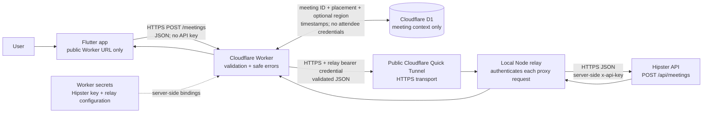
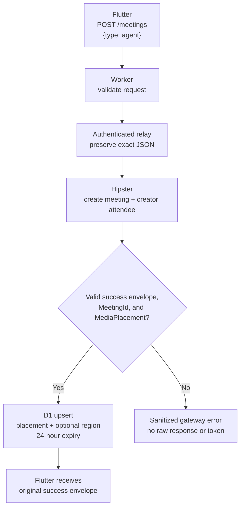
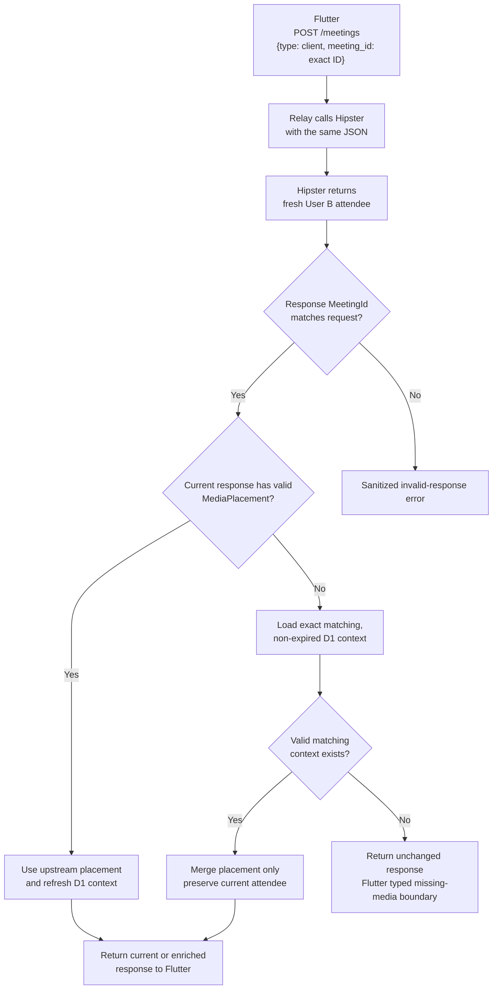
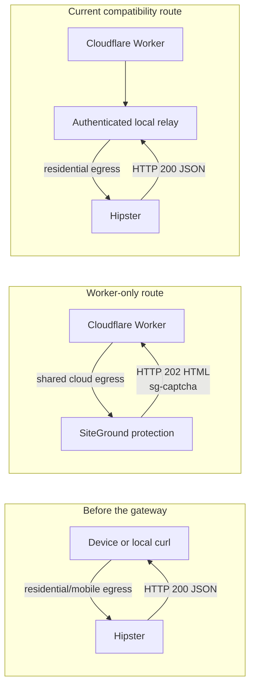
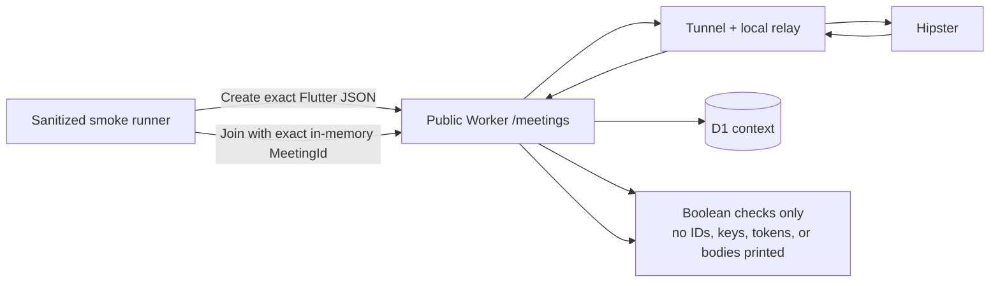

# Meeting Gateway Data Flow

This page explains the currently working assessment/demo route in plain
language. For deployment commands and troubleshooting, see
[CLOUDFLARE_GATEWAY.md](CLOUDFLARE_GATEWAY.md).

## Working architecture

Only `MEETING_API_BASE_URL` is compiled into Flutter. It is a public endpoint,
not a secret. The Hipster key is stored as a Cloudflare Worker secret, is sent
transiently across the authenticated relay request, and is never stored by the
relay or D1.

The local relay is not a general-purpose proxy. Its only proxy route is
`POST /meetings`; `GET /health` is a local health check. It accepts only the
supported agent/client JSON bodies, applies size and timeout limits, and
forwards to one fixed Hipster HTTPS URL.

## Create data flow

The Worker waits for the D1 write before returning Create success. D1 never
stores the creator attendee, `AttendeeId`, `ExternalUserId`, or `JoinToken`.

## Join and MediaPlacement recovery

User B always receives credentials from the current Hipster Join response. The
Worker can merge only the matching cached placement and optional region; it
never reuses User A's attendee, chooses another meeting's context, or invents
Chime URLs.

## Why the Worker-only route failed

The earlier Worker sent the correct HTTPS URL, HTTP method, JSON body, and
server-owned key. The failure was the upstream hosting layer classifying shared
Cloudflare egress as automated traffic and returning an HTML challenge instead
of the Hipster JSON contract. The response contained no usable meeting or
attendee data, so accepting HTTP `202` as success could never work.

Changing D1, Flutter parsing, the timeout, or the API key could not convert the
challenge page into meeting data. The working relay preserves the request
contract and changes only the network egress seen by Hipster.

## How the working route was tested

The live smoke exercised the same public Worker endpoint and JSON bodies used
by Flutter. It verified HTTP and envelope success, required placement fields,
the exact Join meeting match, attendee credential structure, and that User B's
attendee was fresh. Identifiers and credentials remained in memory and were not
printed. An aggregate-only D1 query confirmed context persistence without
reading placement JSON.

This test proves the HTTP gateway, relay, D1 recovery, and attendee isolation.
It did not tap the Flutter UI or verify Android permissions, Chime session
startup, audio/video, reconnect behavior, or native video views.

## Operational boundary

The current Quick Tunnel is a free assessment/demo compatibility path. The
relay computer, Node process, tunnel process, residential internet connection,
and current Worker relay configuration must all remain available. Quick Tunnel
does not provide a production uptime SLA. A production service should use a
stable backend egress accepted by Hipster or a Hipster-provided backend-safe
endpoint while keeping the same Worker, D1, and mobile security boundaries.
