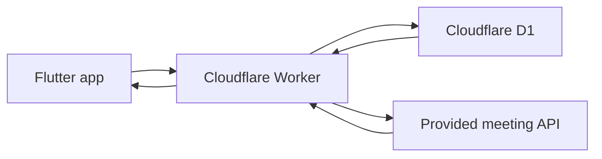
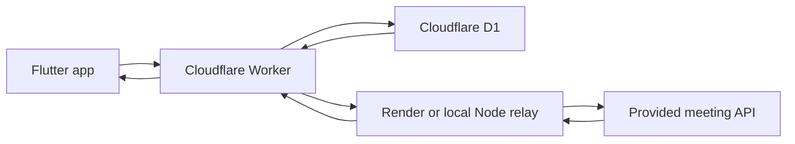
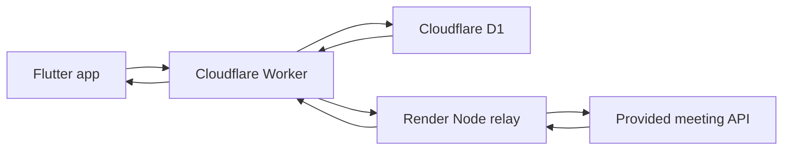

# Setup and Run Guide

This guide covers the local Flutter setup, Cloudflare Worker/D1 deployment, Create/Join usage, optional compatibility relay, Render deployment, optional Apps Script fallback, browser development tooling, and validation commands.

The **normal backend is Cloudflare Worker + D1 only**. The relay paths exist because the upstream hosting layer was observed returning an HTML anti-bot challenge to Cloudflare server egress instead of the documented meeting JSON. Use a relay only when that behavior is reproduced.

## Table of contents

1. [Deployment model](#deployment-model)
2. [Deployed endpoint](#deployed-endpoint)
3. [Prerequisites](#prerequisites)
4. [Flutter dependencies](#flutter-dependencies)
5. [Cloudflare Worker and D1](#cloudflare-worker-and-d1)
6. [Run the Android app](#run-the-android-app)
7. [Create and Join a meeting](#create-and-join-a-meeting)
8. [When a compatibility relay is required](#when-a-compatibility-relay-is-required)
9. [Local relay with Cloudflare Quick Tunnel](#local-relay-with-cloudflare-quick-tunnel)
10. [Render relay](#render-relay)
11. [Apps Script fallback](#apps-script-fallback)
12. [Optional Chrome development adapter](#optional-chrome-development-adapter)
13. [Build and validation](#build-and-validation)
14. [Troubleshooting setup failures](#troubleshooting-setup-failures)

---

## Deployment model

Preferred path:



Compatibility path, used only when the upstream hosting layer challenges Cloudflare server egress:



The Flutter client always calls the public Worker URL. It never needs the upstream API key, relay shared secret, or relay URL.

### Core versus optional infrastructure

| Component | Required? | Purpose |
| --- | --- | --- |
| Flutter app | Yes | Client UI, state orchestration, REST integration, and Chime media |
| Cloudflare Worker | Yes | Public API boundary, secret injection, validation, safe error mapping |
| Cloudflare D1 | Yes | Stores short-lived meeting placement context for exact-ID Join |
| Local relay / Quick Tunnel | Conditional | Changes server egress when the upstream challenges Cloudflare traffic |
| Render relay | Conditional | Hosted version of the same fixed-purpose relay |
| Apps Script relay | Experimental | Alternate egress fallback; not the preferred route |
| Chrome Chime bridge | Optional | Browser development/integration tooling |

### Important note about the checked-in Wrangler configuration

The Worker code treats `HIPSTER_RELAY_URL` and `RELAY_SHARED_SECRET` as optional: when both are absent it calls the meeting API directly.

The current `wrangler.jsonc` also declares them under `secrets.required` because the repository contains the compatibility deployment. Cloudflare validates every secret listed there before deployment. For a **direct-only Worker deployment**, keep only `HIPSTER_API_KEY` in `secrets.required`. For a **relay deployment**, configure all three secret names.

Do not configure dummy relay secrets. Either deploy direct mode intentionally or configure a real authenticated relay.

---

## Deployed endpoint

The currently deployed public gateway is:

```text
https://hipster-meeting-gateway.abhishek-kumar-developer09.workers.dev/
```

Use it as the Flutter build-time public endpoint:

```text
MEETING_API_BASE_URL=https://hipster-meeting-gateway.abhishek-kumar-developer09.workers.dev/
```

Useful routes:

```text
GET  https://hipster-meeting-gateway.abhishek-kumar-developer09.workers.dev/health
POST https://hipster-meeting-gateway.abhishek-kumar-developer09.workers.dev/meetings
```

The URL is safe to publish because it is not an authentication secret. The upstream provider credential remains a Cloudflare Worker secret. The Render relay URL and relay shared secret are server-side configuration and are not required by Flutter.

---

## Prerequisites

Install or configure:

- Flutter with Dart compatible with `^3.11.1`;
- Android SDK;
- JDK 17;
- an ARMv7/ARM64 Android device for real Amazon Chime media validation;
- Node.js;
- pnpm;
- a Cloudflare account;
- a valid meeting API credential supplied by the API owner.

Optional:

- Render account for a hosted relay;
- Cloudflared/Quick Tunnel support through the provided PowerShell relay manager;
- modern Chrome for the optional WebRTC adapter.

The project uses `pnpm` for Node/TypeScript tooling.

---

## Flutter dependencies

From the repository root:

```powershell
flutter pub get
```

Check available devices:

```powershell
flutter devices
```

---

## Cloudflare Worker and D1

Worker project:

```text
cloudflare/hipster-meeting-gateway/
```

### 1. Install Worker dependencies

```powershell
Set-Location cloudflare/hipster-meeting-gateway
pnpm install --frozen-lockfile
```

### 2. Authenticate Wrangler

```powershell
pnpm wrangler whoami
```

If authentication is required:

```powershell
pnpm wrangler login
```

Complete Cloudflare OAuth in the browser.

### 3. Configure D1

The Worker expects:

```text
binding: DB
database name: hipster-meeting-context
migration directory: migrations
```

If you are deploying into a new Cloudflare account:

```powershell
pnpm wrangler d1 create hipster-meeting-context
```

Copy the returned database ID into the `database_id` field for the `DB` binding in `wrangler.jsonc`.

Apply migrations:

```powershell
pnpm wrangler d1 migrations apply hipster-meeting-context --local
pnpm wrangler d1 migrations apply hipster-meeting-context --remote
```

Do not create a second D1 database when the configured database already exists and belongs to the target environment.

### 4. Configure the meeting API credential

Store the upstream credential as a Worker secret:

```powershell
pnpm wrangler secret put HIPSTER_API_KEY
```

Enter the value only at Wrangler's interactive prompt.

Do not put the credential in:

- Dart source;
- `wrangler.jsonc`;
- source-controlled `.env` files;
- command-line arguments;
- CI YAML;
- README files;
- logs.

Verify only the secret name:

```powershell
pnpm wrangler secret list
```

### 5. Direct mode

If the upstream accepts Cloudflare server egress, no relay is needed.

The direct request path is:

```text
Flutter
  -> Cloudflare Worker
  -> provided meeting API
```

The Worker injects `x-api-key` server-side and validates the response before returning it to Flutter.

### 6. Validate and deploy

```powershell
pnpm wrangler types
pnpm run typecheck
pnpm test
pnpm wrangler deploy --dry-run
pnpm wrangler deploy
```

Health check:

```powershell
Invoke-WebRequest `
  -Uri https://hipster-meeting-gateway.abhishek-kumar-developer09.workers.dev/health `
  -Method Get
```

Expected result:

```text
HTTP 200
```

A successful health check confirms the Worker route is reachable. It does not create a meeting.

---

## Run the Android app

Return to the repository root:

```powershell
Set-Location ../..
```

Run with an explicit Worker URL:

```powershell
flutter run -d <android-device-id> `
  --dart-define=MEETING_API_BASE_URL=https://hipster-meeting-gateway.abhishek-kumar-developer09.workers.dev/
```

`MEETING_API_BASE_URL` is public configuration. The upstream API credential remains server-side.

The app also defines a default public Worker URL, but passing the target environment explicitly makes local, staging, and release behavior reproducible.

---

## Create and Join a meeting

### User A: Create

1. Launch the app.
2. Tap **Create Meeting**.
3. The app validates connectivity and permissions.
4. Flutter sends:

```json
{
  "type": "agent"
}
```

to the Worker.
5. The Worker calls the meeting API using the server-side credential.
6. The Worker validates `MeetingId`, attendee credentials, and `MediaPlacement`.
7. The Worker stores only reusable placement context in D1.
8. Flutter starts the Chime media session.
9. The UI becomes `connected` only after the Chime session-start callback.
10. Copy the returned `MeetingId`.

### User B: Join

1. Launch the second client.
2. Choose **Join Meeting**.
3. Enter the exact `MeetingId` returned to User A.
4. Flutter sends:

```json
{
  "type": "client",
  "meeting_id": "<exact MeetingId>"
}
```

5. The Worker requests a fresh attendee from the meeting API.
6. If the Join response omits `MediaPlacement`, the Worker restores only the matching placement from D1.
7. The current Join attendee credentials are preserved; creator credentials are never reused.
8. Flutter starts Chime with the fresh attendee and resolved placement.
9. Wait for `connected`.

### Runtime checks

After both clients connect, verify:

- local and remote video;
- two-way audio;
- mute/unmute;
- camera off/on;
- camera switch;
- participant joined/left callbacks;
- leave;
- rejoin using the same meeting ID;
- reconnect behavior when network is interrupted;
- diagnostics and the last-50 event log.

---

## When a compatibility relay is required

The relay is **not part of the normal application architecture**.

During integration, Cloudflare successfully reached the upstream host but the hosting layer returned:

```text
HTTP 202
Content-Type: HTML
sg-captcha header present
```

instead of the documented meeting JSON.

That response contains no usable Chime bootstrap and must not be accepted as meeting success.

If a Worker Create request fails with the gateway category for an upstream anti-bot/non-JSON response while direct local calls to the meeting API succeed, use one of the relay options below. The relay changes only the server egress path; Flutter still calls the Worker and the API credential remains server-side.

Do not solve this by:

- moving the API key into Flutter;
- treating HTTP 202 HTML as meeting success;
- retrying indefinitely;
- fabricating `MediaPlacement`;
- reusing creator attendee credentials.

---

## Local relay with Cloudflare Quick Tunnel

Use this for local compatibility testing when direct Worker egress is challenged.

`local-relay/start.ps1` automates the compatibility path: it starts `local-relay/server.mjs`, creates/loads the server-only shared secret, starts a Cloudflare Quick Tunnel, writes the tunnel URL into the Worker as `HIPSTER_RELAY_URL`, and redeploys the Worker. Flutter still calls the same public Worker URL.

From the Worker directory:

```powershell
Set-Location cloudflare/hipster-meeting-gateway
.\local-relay\start.ps1
```

The manager:

1. creates or loads a strong relay shared secret;
2. stores local relay state under ignored `.wrangler/local-relay/`;
3. installs/updates the matching `RELAY_SHARED_SECRET` Worker secret;
4. starts the dependency-free Node relay on loopback;
5. waits for `GET /health`;
6. starts a Cloudflare Quick Tunnel;
7. checks tunnel health;
8. stores the tunnel URL in the Worker as `HIPSTER_RELAY_URL`;
9. redeploys the Worker.

The client still knows only the public Worker URL.

### Relay tests

```powershell
pnpm run typecheck
pnpm test
```

### Sanitized live smoke test

Run only when a real meeting API probe is appropriate:

```powershell
$env:MEETING_API_BASE_URL = 'https://hipster-meeting-gateway.abhishek-kumar-developer09.workers.dev/'
node local-relay/smoke.mjs
Remove-Item Env:MEETING_API_BASE_URL
```

The smoke runner checks response structure without printing meeting IDs, attendee IDs, JoinTokens, placement URLs, API keys, or full response bodies.

### Limitation

Quick Tunnel is development infrastructure. The local machine, Node process, tunnel process, and network connection must stay online.

---

## Render relay

`render.yaml` deploys the same fixed-purpose Node relay as a Render Web Service.

The relay is a server-to-server compatibility hop. Flutter never calls it directly:



The Worker authenticates to the relay using `RELAY_SHARED_SECRET`. The upstream provider key is forwarded to the relay transiently for the single fixed `/meetings` request and is then applied to the upstream request. The relay does not own D1 and does not persist meeting or attendee credentials.

The generated Render HTTPS base URL is stored in Cloudflare as `HIPSTER_RELAY_URL`. It is intentionally not a Flutter configuration value. `render.yaml` defines the service name and runtime, while Render assigns the final public hostname at deployment time.

The checked-in Blueprint uses:

```text
service name: hipster-meeting-relay
runtime: node
plan: free
rootDir: cloudflare/hipster-meeting-gateway
build: pnpm install --frozen-lockfile --prod
start: node local-relay/server.mjs
health check: /health
bind host: 0.0.0.0
secret: RELAY_SHARED_SECRET
```

### Deploy

1. Push the repository to source control.
2. In Render, create a Blueprint from `render.yaml`.
3. Generate a strong relay shared secret of at least 32 characters/bytes.
4. Enter it in Render as `RELAY_SHARED_SECRET`.
5. Configure the same value in Cloudflare:

```powershell
Set-Location cloudflare/hipster-meeting-gateway
pnpm wrangler secret put RELAY_SHARED_SECRET
```

6. Wait for Render `/health` to report healthy.
7. Copy the Render HTTPS service URL.
8. Store it in Cloudflare:

```powershell
pnpm wrangler secret put HIPSTER_RELAY_URL
```

9. Redeploy the Worker:

```powershell
pnpm wrangler deploy
```

10. Verify Worker `/health`.
11. Run a sanitized Create/Join smoke before relying on the relay.

### Render Free cold-start limitation

A sleeping free Render service can take longer to wake than the application's current request budgets. The Worker upstream timeout is approximately 12 seconds and Flutter's outer HTTP timeout is approximately 15 seconds. A cold relay may therefore time out the first request.

Render is a compatibility deployment option, not an uptime guarantee.

---

## Apps Script fallback

The repository contains:

```text
cloudflare/hipster-meeting-gateway/apps-script/Code.gs
```

This is an experimental egress fallback.

The Worker supplies the upstream credential transiently; the Apps Script stores only the relay shared secret in Script Properties.

Use this only after the direct Worker and normal authenticated relay options have been evaluated. Apps Script deployment/access behavior can introduce redirects or HTML responses instead of the expected JSON.

If the Worker reports `upstream_non_json`, verify that the Apps Script deployment is publicly callable as intended and is not returning a login/deployment page.

---

## Optional Chrome development adapter

Chrome support is development/integration tooling and is not part of the primary mobile platform scope.

Build the local Chime JS bundle:

```powershell
Set-Location web/chime_bridge
pnpm install --frozen-lockfile
pnpm run typecheck
pnpm test
pnpm run build
Set-Location ../..
```

Run Flutter Web through the Worker:

```powershell
flutter run -d chrome `
  --dart-define=MEETING_API_BASE_URL=https://hipster-meeting-gateway.abhishek-kumar-developer09.workers.dev/
```

For a shared/published build, the browser should use the same Worker control plane. Do not place the upstream API credential in browser source or browser storage.

The optional web adapter includes typed Dart/JavaScript interop, local/remote HTML video surfaces, browser device handling, Chime reconnect mapping, and generation-safe cleanup.

---

## Build and validation

### Flutter quality gates

```powershell
dart format --output=none --set-exit-if-changed lib test
flutter analyze
flutter test
```

### Android debug APK

```powershell
flutter build apk --debug `
  --dart-define=MEETING_API_BASE_URL=https://hipster-meeting-gateway.abhishek-kumar-developer09.workers.dev/
```

### Android release

Release signing is read from ignored local `android/key.properties` when present.

Example:

```properties
storeFile=<path-to-keystore>
storePassword=<local-secret>
keyAlias=<local-alias>
keyPassword=<local-secret>
```

Build:

```powershell
flutter build appbundle --release --dart-define=MEETING_API_BASE_URL=YOUR_CLOUDFlARE_WORKER_URL
```

Never commit the keystore or `key.properties`.

### Repository validation script

The root validation helper runs the main Flutter quality gates, performs repository hygiene checks, builds a configured Android debug APK, and copies the artifact to the ignored `artifacts/` directory:

```powershell
.\scripts\validate_submission.ps1 `
  -MeetingApiBaseUrl 'https://hipster-meeting-gateway.abhishek-kumar-developer09.workers.dev/'
```

### Worker validation

```powershell
Set-Location cloudflare/hipster-meeting-gateway
pnpm run typecheck
pnpm test
```

### Optional web bridge validation

```powershell
Set-Location web/chime_bridge
pnpm run typecheck
pnpm test
pnpm run build
```

---

## Troubleshooting setup failures

### Worker deploy reports missing relay secrets

Check whether you are deploying:

- **direct mode**: `HIPSTER_API_KEY` is required; relay bindings should not be declared as required;
- **relay mode**: `HIPSTER_API_KEY`, `HIPSTER_RELAY_URL`, and `RELAY_SHARED_SECRET` must all be configured.

Never use placeholder secret values simply to satisfy deployment validation.

### Worker health succeeds but Create fails

Inspect the safe gateway category/headers.

A healthy Worker only proves that the Worker route is deployed. Create additionally depends on:

- a valid upstream API credential;
- valid upstream JSON;
- D1 availability;
- the upstream hosting path accepting the Worker/relay egress.

### HTTP 202 with HTML or `sg-captcha`

This is not a successful Create response. Use the compatibility-relay section above or obtain an upstream endpoint that accepts backend server traffic.

### Join fails with missing media configuration

A Join attendee must be fresh. The Worker may enrich a Join response only with cached `MediaPlacement` for the exact meeting ID. It must never fabricate endpoints or reuse User A credentials.

### Chime does not reach `connected`

API success is only bootstrap success. The UI reaches `connected` from the Chime session-start callback. Inspect the in-app event log and Android troubleshooting guide:

[`ANDROID_TROUBLESHOOTING.md`](ANDROID_TROUBLESHOOTING.md)

---

Return to the project overview:

[`../README.md`](../README.md)
